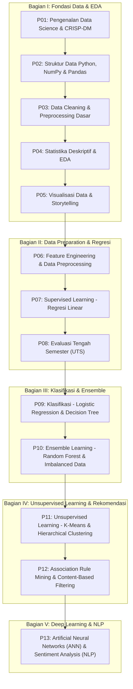

# 📊 Data Science — Rekam Jejak Pembelajaran & Portofolio Praktikum
### Universitas Siber Asia (UNSIA) — Program Studi PJJ Informatika

[](https://www.python.org/)
[](https://jupyter.org/)
[](https://scikit-learn.org/)
[](https://www.tensorflow.org/)
[](https://pandas.pydata.org/)
[](https://numpy.org/)

---

## 📌 Informasi Mahasiswa

| Informasi | Keterangan |
| :--- | :--- |
| **Nama Lengkap** | **Richi Ilham Hadiputra** |
| **NIM** | **240401020163** |
| **Kelas** | **IF403** |
| **Program Studi** | **S1 Informatika (PJJ)** |
| **Mata Kuliah** | **Data Science** |
| **Institusi** | **Universitas Siber Asia (UNSIA)** |

---

## 📖 Tentang Repositori

Repositori ini merupakan rekam jejak perkuliahan, dokumentasi praktikum laboratorium, dan portofolio tugas pemrograman mata kuliah **Data Science** dari **Pertemuan 1 hingga Pertemuan 13**. 

Materi dalam repositori ini dirancang secara berjenjang dan komprehensif mengikuti standar siklus hidup data science (**CRISP-DM**), mulai dari fondasi manipulasi data numerik dan tabular, teknik *data cleansing*, analisis statistik deskriptif & eksploratif (EDA), *storytelling* visualisasi, rekayasa fitur (*data preprocessing*), algoritma *Supervised Learning* (Regresi, Klasifikasi, Ensemble Learning), *Unsupervised Learning* (K-Means & Hierarchical Clustering), *Association Rule Mining*, hingga pengantar *Deep Learning* (Neural Networks / MLP) dan *Natural Language Processing* (NLP).

Setiap pertemuan dilengkapi implementasi kode Python interaktif menggunakan Jupyter Notebook dengan studi kasus riil dan dataset publik terstandar.

---

## 🗺️ Peta Kurikulum & Silabus Pembelajaran



---

## 📋 Tabel Rekapitulasi Materi & Tautan Notebook

| Pertemuan | Topik / Fokus Materi | Dataset yang Digunakan | Algoritma / Metode Utama | Tautan Notebook |
| :---: | :--- | :--- | :--- | :---: |
| **01** | **Pengenalan Data Science & CRISP-DM**<br>• Definisi, pilar, dan ekosistem Data Science<br>• 6 Tahapan metodologi CRISP-DM | *Konsep Teoretis & Framework* | CRISP-DM Framework | *Materi Modul* |
| **02** | **Struktur Data Python, NumPy & Pandas**<br>• List, Dict, Tuple, Set & NumPy Vectorization<br>• Eksplorasi DataFrame, missing values, & agregasi | `Titanic Dataset` | Pandas Aggregation, GroupBy | [Buka Notebook](./DataSciencePertemuan2.ipynb) |
| **03** | **Data Cleaning: Missing Values & Outlier**<br>• Hapus duplikat, standardisasi string<br>• Imputasi statistik & IQR Winsorization/Clipping | `Housing Dirty Dataset` (`housing_dirty.csv`) | IQR Fence, Median Imputation, String Normalization | [Buka Notebook](./DataSciencePertemuan3.ipynb) |
| **04** | **Statistika Deskriptif & Exploratory Data Analysis (EDA)**<br>• Ukuran pemusatan, penyebaran, skewness, kurtosis<br>• Distribusi data, boxplot, violin plot, & korelasi | `Iris Dataset` | Pearson Correlation, KDE, Boxplot & Violin Plot | [Buka Notebook](./DataSciencePertemuan4.ipynb) |
| **05** | **Visualisasi Data & Dashboard Storytelling**<br>• 5 Prinsip visualisasi efektif<br>• Multi-plot GridSpec dashboard & estetik visual | `Tips Dataset` | Matplotlib GridSpec, Seaborn Faceting | [Buka Notebook](./DataSciencePertemuan5.ipynb) |
| **06** | **Persiapan Data (Data Preparation / Preprocessing)**<br>• Imputasi missing values (Median/Mode)<br>• One-Hot Encoding, Train-Test Split, & Scaling | `Titanic Dataset` | `StandardScaler`, `get_dummies`, `StratifiedSplit` | [Buka Notebook](./DataSciencePertemuan6.ipynb) |
| **07** | **Supervised Learning: Regresi Linear**<br>• Formulasi regresi multivariat & interpretasi koefisien<br>• Evaluasi MAE, MSE, RMSE, R² & Residual Plot | `Synthetic Salary Dataset` | `LinearRegression`, Residual Analysis | [Buka Notebook](./DataSciencePertemuan7.ipynb) |
| **08** | **Ujian Tengah Semester (UTS)**<br>• Evaluasi komprehensif materi Pertemuan 1–7 | *Sintesis Proyek Tengah Semester* | *Review & Evaluasi* | *Arsip Evaluasi* |
| **09** | **Supervised Learning: Klasifikasi Biner**<br>• Pemodelan Regresi Logistik & Pohon Keputusan<br>• Evaluasi Confusion Matrix, Akurasi, Presisi, Recall, F1 | `Breast Cancer Wisconsin Dataset` | `LogisticRegression`, `DecisionTreeClassifier` | [Buka Notebook](./DataSciencePertemuan9.ipynb) |
| **10** | **Ensemble Learning & Penanganan Imbalanced Data**<br>• Random Forest Classifier (Bagging)<br>• Penanganan imbalanced class & evaluasi ROC-AUC | `Telco Customer Churn Dataset` | `RandomForestClassifier`, `class_weight='balanced'`, ROC-AUC | [Buka Notebook](./DataSciencePertemuan10%20(1).ipynb) |
| **11** | **Unsupervised Learning: Analisis Klaster (Clustering)**<br>• K-Means Clustering, Elbow Method, Silhouette Score<br>• Hierarchical Clustering & Visualisasi Dendrogram | `Synthetic Customer Mall Dataset` | `KMeans` (k-means++), `linkage` (Ward), Dendrogram | [Buka Notebook](./DataSciencePertemuan11.ipynb) |
| **12** | **Association Rule Mining & Sistem Rekomendasi**<br>• Market Basket Analysis (Support, Confidence, Lift)<br>• Content-Based Filtering via Cosine Similarity | `Retail Grocery Transactions` | `apriori` (mlxtend), `association_rules`, `cosine_similarity` | [Buka Notebook](./DataSciencePertemuan12.ipynb) |
| **13** | **Pengantar Deep Learning & Natural Language Processing (NLP)**<br>• Artificial Neural Networks (ANN/MLP) dengan Keras<br>• Analisis Sentimen Teks menggunakan TF-IDF & Regresi Logistik | `Moons Non-Linear Data` & `Customer Reviews Dataset` | Multi-Layer Perceptron (`Sequential`), `TfidfVectorizer` | [Buka Notebook](./DataSciencePertemuan13.ipynb) |

---

## 🔬 Rincian Silabus & Pembahasan Teknis per Pertemuan

<details>
<summary><b>Pertemuan 01 — Pengenalan Data Science & Metodologi CRISP-DM</b></summary>

- **Capaian Pembelajaran**: Memahami definisi formal, peranan multidisiplin Data Science (Ilmu Komputer, Matematika/Statistika, dan Pengetahuan Domain Bisnis), serta tahapan standar industri.
- **Kerangka Kerja CRISP-DM (*Cross-Industry Standard Process for Data Mining*)**:
  1. *Business Understanding*: Penentuan tujuan proyek dan konversi ke problem statement analitis.
  2. *Data Understanding*: Pengumpulan awal, eksplorasi karakteristik, dan verifikasi kualitas data.
  3. *Data Preparation*: Pembersihan data, rekayasa fitur (*feature engineering*), dan transformasi tabel.
  4. *Modeling*: Pemilihan dan pelatihan algoritma machine learning.
  5. *Evaluation*: Pengujian performa model terhadap metrik evaluasi teknis dan tolok ukur bisnis.
  6. *Deployment*: Pengemasan model ke lingkungan produksi atau pembuatan laporan analitik.
</details>

<details>
<summary><b>Pertemuan 02 — Struktur Data Python, NumPy & Pandas</b></summary>

- **Dataset**: `Titanic Dataset`
- **Fokus Pembahasan**:
  - Manipulasi struktur data Python native (`list`, `tuple`, `dict`, `set`).
  - Vektorisasi komputasi array multidimensi dengan **NumPy**.
  - Operasi DataFrame **Pandas**: inspeksi dimensi (`.shape`), ekstraksi kolom (`.columns`), perhitungan missing value (`.isnull().sum()`), dan kalkulasi proporsi.
  - Analisis agregasi demografi penumpang: korelasi keselamatan berdasarkan kelas kabin (`Pclass`) dan jenis kelamin (`Sex`).
- **File Notebook**: [`DataSciencePertemuan2.ipynb`](./DataSciencePertemuan2.ipynb)
</details>

<details>
<summary><b>Pertemuan 03 — Data Cleaning: Missing Values, Outlier & Validasi</b></summary>

- **Dataset**: `housing_dirty.csv` (Dataset Properti Perumahan)
- **Fokus Pembahasan**:
  - Deteksi dan eliminasi baris duplikat (`drop_duplicates`).
  - Normalisasi dan standardisasi data string (*whitespace stripping*, *case formatting*).
  - Imputasi nilai kosong menggunakan statistik deskriptif (*median* untuk variabel numerik miring/skewed, *mode* untuk variabel kategorikal).
  - Deteksi pencilan (*outliers*) berbasis rentang interkuartil (**IQR Fence**) dan teknik *clipping* / Winsorization.
  - Verifikasi integritas data (*assertion test*) dan penyimpanan dataset bersih (`housing_clean.csv`).
- **File Notebook**: [`DataSciencePertemuan3.ipynb`](./DataSciencePertemuan3.ipynb)
</details>

<details>
<summary><b>Pertemuan 04 — Statistika Deskriptif & Exploratory Data Analysis (EDA)</b></summary>

- **Dataset**: `Iris Dataset`
- **Fokus Pembahasan**:
  - Perhitungan ukuran pemusatan (*Mean, Median, Modus*) dan ukuran penyebaran (*Standar Deviasi, Varians, Rentang*).
  - Analisis bentuk distribusi statistik: *Skewness* (kemiringan kurva) dan *Kurtosis* (keruncingan kurva).
  - Visualisasi distribusi univariat: Histogram dengan kurva *Kernel Density Estimation* (KDE).
  - Analisis bivariat/multivariat menggunakan **Boxplot**, **Violin Plot**, dan **Scatter Plot**.
  - Matriks Korelasi Pearson untuk mengukur derajat korelasi linear antarfitor numerik serta visualisasi **Heatmap Korelasi**.
- **File Notebook**: [`DataSciencePertemuan4.ipynb`](./DataSciencePertemuan4.ipynb)
</details>

<details>
<summary><b>Pertemuan 05 — Visualisasi Data & Storytelling Dashboard</b></summary>

- **Dataset**: `Tips Dataset`
- **Fokus Pembahasan**:
  - Implementasi 5 pilar visualisasi data: *Clarity* (kejelasan), *Accuracy* (ketepatan), *Efficiency* (efisiensi ruang informasi), *Aesthetics* (keindahan), dan *Context* (relevansi bisnis).
  - Penyusunan tata letak dashboard multi-plot terintegrasi menggunakan Matplotlib `GridSpec` (2x2 subplots).
  - Kombinasi grafik tematik: Bar Chart (perbandingan total tagihan harian), Histogram + KDE (distribusi waktu makan), Boxplot (sebaran gender vs total bill), dan Scatter Plot dengan garis regresi.
  - Ekspor gambar visualisasi resolusi tinggi (`dashboard_tips.png`).
- **File Notebook**: [`DataSciencePertemuan5.ipynb`](./DataSciencePertemuan5.ipynb)
</details>

<details>
<summary><b>Pertemuan 06 — Persiapan Data (Data Preparation / Preprocessing)</b></summary>

- **Dataset**: `Titanic Dataset`
- **Fokus Pembahasan**:
  - Penanganan nilai hilang pada atribut `age` (imputasi median) dan `embarked` (imputasi modus).
  - Transformasi variabel kategorikal menjadi numerik menggunakan **One-Hot Encoding** (`pd.get_dummies` dengan `drop_first=True` untuk menghindari *Dummy Variable Trap*).
  - Pembagian data latih dan data uji (**Train-Test Split**) menggunakan metode *Stratified Sampling* (`stratify=y`) untuk mempertahankan rasio kelas target.
  - Standarisasi skala fitur numerik menggunakan **`StandardScaler`** (\(Z = \frac{X - \mu}{\sigma}\)) dengan isolasi pembelajaran parameter (\(\mu, \sigma\)) pada data latih guna mencegah kebocoran data (*Data Leakage*).
- **File Notebook**: [`DataSciencePertemuan6.ipynb`](./DataSciencePertemuan6.ipynb)
</details>

<details>
<summary><b>Pertemuan 07 — Supervised Learning: Regresi Linear</b></summary>

- **Dataset**: `Synthetic Salary Dataset` (Pengalaman Kerja, Tingkat Pendidikan, dan Lokasi Kota)
- **Fokus Pembahasan**:
  - Konsep matematis Regresi Linear Multivariat: \(y = \beta_0 + \beta_1 X_1 + \dots + \beta_n X_n + \epsilon\).
  - Pelatihan model `LinearRegression` Scikit-Learn dan interpretasi nilai bobot koefisien (\(\beta\)) serta intercept.
  - Perhitungan metrik evaluasi regresi: *Mean Absolute Error* (MAE), *Mean Squared Error* (MSE), *Root Mean Squared Error* (RMSE), dan *Coefficient of Determination* (\(R^2\)).
  - Analisis diagnostik model melalui **Actual vs Predicted Plot** dan **Residual Plot** untuk validasi asumsi homoskedastisitas dan linearitas.
- **File Notebook**: [`DataSciencePertemuan7.ipynb`](./DataSciencePertemuan7.ipynb)
</details>

<details>
<summary><b>Pertemuan 08 — Ujian Tengah Semester (UTS)</b></summary>

- **Fokus Evaluasi**: Ujian Tengah Semester (UTS) / Review menyeluruh implementasi pipeline data science dari tahap pemahaman data, data cleaning, analisis eksploratif (EDA), rekayasa fitur, hingga evaluasi model regresi linear.
</details>

<details>
<summary><b>Pertemuan 09 — Supervised Learning: Klasifikasi Biner</b></summary>

- **Dataset**: `Breast Cancer Wisconsin (Diagnostic) Dataset`
- **Fokus Pembahasan**:
  - Konsep masalah klasifikasi biner (Malignant vs Benign) dan batas keputusan (*decision boundary*).
  - Pelatihan model **Regresi Logistik** (*Logistic Regression*) dengan standardisasi fitur dan analisis fitur paling berpengaruh melalui bobot koefisien log-odds.
  - Pelatihan model **Pohon Keputusan** (*Decision Tree Classifier*) dengan pembatasan kedalaman (`max_depth=4`) untuk menghindari overfitting.
  - Visualisasi struktur pohon keputusan (`plot_tree`).
  - Evaluasi performa model komprehensif menggunakan **Confusion Matrix**, **Accuracy**, **Precision**, **Recall**, dan **F1-Score**.
- **File Notebook**: [`DataSciencePertemuan9.ipynb`](./DataSciencePertemuan9.ipynb)
</details>

<details>
<summary><b>Pertemuan 10 — Ensemble Learning & Penanganan Imbalanced Data</b></summary>

- **Dataset**: `Telco Customer Churn Dataset` (IBM)
- **Fokus Pembahasan**:
  - Pengantar *Ensemble Learning* berbasis teknik *Bagging* (Bootstrap Aggregating).
  - Implementasi algoritma **Random Forest Classifier** (`n_estimators=300`) untuk memprediksi churn pelanggan telekomunikasi.
  - Penanganan ketidakseimbangan kelas (*class imbalance*) menggunakan parameter penimbang penalti `class_weight='balanced'`.
  - Ekstraksi probabilitas prediksi pelanggan (`predict_proba`) untuk analisis tingkat risiko churn.
  - Evaluasi model melalui **Classification Report** dan metrik **ROC-AUC** (*Receiver Operating Characteristic - Area Under Curve*).
- **File Notebook**: [`DataSciencePertemuan10 (1).ipynb`](./DataSciencePertemuan10%20(1).ipynb)
</details>

<details>
<summary><b>Pertemuan 11 — Unsupervised Learning: Analisis Klaster (Clustering)</b></summary>

- **Dataset**: `Synthetic Customer Mall Dataset` (Pendapatan Tahunan & Skor Belanja)
- **Fokus Pembahasan**:
  - Konsep *Unsupervised Learning* untuk segmentasi data tanpa label target.
  - Standarisasi data fitur menggunakan `StandardScaler`.
  - Penentuan jumlah klaster optimal (\(K\)) pada **K-Means Clustering** menggunakan **Metode Siku** (*Elbow Method* / Within-Cluster Sum of Squares - WCSS) dan **Silhouette Score**.
  - Pemodelan K-Means dengan inisialisasi `k-means++` serta visualisasi pemetaan klaster beserta posisi titik pusat (*Centroid*).
  - Pemodelan **Hierarchical Clustering** menggunakan metode aglomeratif Ward Linkage (`scipy.cluster.hierarchy`) dan interpretasi **Dendrogram**.
- **File Notebook**: [`DataSciencePertemuan11.ipynb`](./DataSciencePertemuan11.ipynb)
</details>

<details>
<summary><b>Pertemuan 12 — Association Rule Mining & Sistem Rekomendasi</b></summary>

- **Dataset**: `Synthetic Retail Transaction Data` (Keranjang Belanja Supermarket) & `Katalog Produk`
- **Fokus Pembahasan**:
  - Transformasi data transaksi menjadi representasi matriks biner menggunakan `TransactionEncoder` dari library `mlxtend`.
  - Penemuan pola belanja bersama (*Frequent Itemsets*) menggunakan **Algoritma Apriori** dengan variasi ambang batas *Minimum Support*.
  - Ekstraksi aturan asosiasi (*Association Rules*) berdasarkan metrik **Support**, **Confidence**, dan **Lift** (\(\text{Lift} > 1\)).
  - Pembangunan model Sistem Rekomendasi berbasis kesamaan karakteristik (**Content-Based Filtering**) menggunakan **Cosine Similarity** (`sklearn.metrics.pairwise.cosine_similarity`).
  - Studi perbandingan antara pendekatan aturan asosiasi transaksi (*Market Basket Analysis*) dengan *Content-Based Filtering*.
- **File Notebook**: [`DataSciencePertemuan12.ipynb`](./DataSciencePertemuan12.ipynb)
</details>

<details>
<summary><b>Pertemuan 13 — Pengantar Deep Learning & Natural Language Processing (NLP)</b></summary>

- **Dataset**: `Make Moons Dataset` (Data Non-Linear 2D) & `Customer Product Reviews` (Teks Sentimen Bahasa Indonesia)
- **Fokus Pembahasan**:
  - **Deep Learning / Artificial Neural Networks (ANN)**:
    - Keterbatasan pemisah linear pada data non-linear (*make_moons*).
    - Perancangan arsitektur Multi-Layer Perceptron (MLP) dengan **TensorFlow / Keras**: Input Layer, Hidden Layers (`Dense` dengan aktivasi `ReLU`), dan Output Layer (`Dense` 1 unit dengan aktivasi `Sigmoid`).
    - Kompilasi model dengan optimizer `adam` dan loss function `binary_crossentropy`.
    - Evaluasi kurva pembelajaran (*Learning Curve*: Training vs. Validation Loss & Accuracy) untuk memantau generalisasi model.
  - **Natural Language Processing (NLP) & Sentiment Analysis**:
    - Ekstraksi fitur tekstual ulasan produk ke dalam representasi numerik menggunakan **TF-IDF Vectorization** (`TfidfVectorizer`).
    - Pelatihan model klasifikasi sentimen (Positif vs Negatif) menggunakan **Logistic Regression**.
    - Uji inferensi prediksi sentimen pada kalimat ulasan baru secara real-time.
- **File Notebook**: [`DataSciencePertemuan13.ipynb`](./DataSciencePertemuan13.ipynb)
</details>

---

## 🛠️ Ekosistem & Stack Teknologi

Proyek-proyek pada repositori ini dikembangkan menggunakan ekosistem Data Science Python modern:

| Kategori | Pustaka / Tools | Deskripsi & Penggunaan |
| :--- | :--- | :--- |
| **Language & Env** | **Python 3.9+**, **Jupyter Notebook** | Bahasa pemrograman utama dan lingkungan komputasi interaktif. |
| **Data Manipulation** | **Pandas**, **NumPy**, **SciPy** | Struktur data tabular (DataFrame), manipulasi array n-dimensi, kalkulasi statistik dan *winsorization*. |
| **Data Visualization** | **Matplotlib**, **Seaborn** | Pembuatan grafik statistik, heatmap matriks, multi-panel dashboard (`GridSpec`), dan plot diagnostik model. |
| **Machine Learning** | **Scikit-Learn (sklearn)** | Prapemrosesan data, penskalaan (*StandardScaler*), *Train-Test Split*, model regresi, klasifikasi, clustering (*K-Means*), dan metrik evaluasi. |
| **Pattern Mining** | **MLxtend** | Pengolahan data transaksi (*TransactionEncoder*) dan implementasi algoritma *Apriori Association Rules*. |
| **Deep Learning** | **TensorFlow / Keras** | Perancangan, pelatihan, dan evaluasi arsitektur Jaringan Saraf Tiruan (*Artificial Neural Networks / MLP*). |
| **Text Processing** | **Scikit-Learn NLP (`TfidfVectorizer`)** | Ekstraksi fitur pembobotan kata (TF-IDF) untuk klasifikasi teks dan analisis sentimen. |

---

## 🚀 Panduan Menjalankan Notebook Secara Lokal

Untuk menjalankan berkas-berkas notebook yang ada di repositori ini pada komputer lokal Anda:

### 1. Klon Repositori
```bash
git clone https://github.com/RDR-1369/DataScienceUNSIA.git
cd DataScienceUNSIA
```

### 2. Buat dan Aktifkan Virtual Environment (Disarankan)
```bash
# Windows
python -m venv venv
.\venv\Scripts\activate

# Linux / macOS
python3 -m venv venv
source venv/bin/activate
```

### 3. Pasang Pustaka yang Diperlukan
```bash
pip install numpy pandas matplotlib seaborn scipy scikit-learn mlxtend tensorflow jupyter
```

### 4. Jalankan Jupyter Notebook
```bash
jupyter notebook
```
Akses berkas `.ipynb` yang diinginkan melalui antarmuka peramban yang muncul secara otomatis.

---

## 📂 Struktur Direktori Repositori

```text
DataScienceUNSIA/
├── README.md                           # Dokumentasi utama & rekam jejak perkuliahan
├── housing_dirty.csv                   # Dataset kotor untuk praktikum Data Cleaning (P03)
├── DataSciencePertemuan2.ipynb          # Notebook P02: Struktur Data Python, NumPy & Pandas
├── DataSciencePertemuan3.ipynb          # Notebook P03: Data Cleaning & Preprocessing Dasar
├── DataSciencePertemuan4.ipynb          # Notebook P04: Statistika Deskriptif & EDA
├── DataSciencePertemuan5.ipynb          # Notebook P05: Visualisasi Data & Storytelling Dashboard
├── DataSciencePertemuan6.ipynb          # Notebook P06: Data Preparation & Preprocessing (Titanic)
├── DataSciencePertemuan7.ipynb          # Notebook P07: Supervised Learning - Regresi Linear
├── DataSciencePertemuan9.ipynb          # Notebook P09: Supervised Learning - Klasifikasi Biner
├── DataSciencePertemuan10 (1).ipynb     # Notebook P10: Ensemble Learning - Random Forest
├── DataSciencePertemuan11.ipynb         # Notebook P11: Unsupervised Learning - K-Means & Clustering
├── DataSciencePertemuan12.ipynb         # Notebook P12: Association Rules (Apriori) & Rekomendasi
└── DataSciencePertemuan13.ipynb         # Notebook P13: Deep Learning (ANN) & NLP Sentiment Analysis
```

---

## 👤 Kontak & Tautan

- **Nama**: Richi Ilham Hadiputra
- **GitHub**: [@RDR-1369](https://github.com/RDR-1369)
- **Repositori**: [DataScienceUNSIA](https://github.com/RDR-1369/DataScienceUNSIA)
- **Program Studi**: S1 Informatika, Universitas Siber Asia

---
*Dokumentasi ini disusun dan diperbarui secara berkala sebagai bentuk pemenuhan standar akademis dan portofolio pembelajaran praktis Data Science.*
